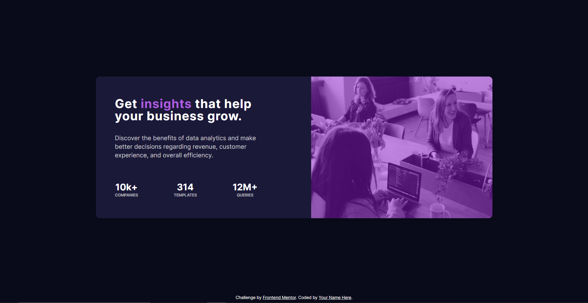

# Frontend Mentor - Stats preview card component solution

This is a solution to the [Stats preview card component challenge on Frontend Mentor](https://www.frontendmentor.io/challenges/stats-preview-card-component-8JqbgoU62). Frontend Mentor challenges help you improve your coding skills by building realistic projects. 

## Table of contents
  - [Overview](#overview)
    - [The challenge](#the-challenge)
    - [Screenshot](#screenshot)
    - [Links](#links)
  - [Built with](#built-with)
  - [Author](#author)

## Overview

### The challenge

Users should be able to:

- View the optimal layout depending on their device's screen size

### Screenshot

#### Mobile view

#### Desktop view

### Links

- [Solution URL](https://www.frontendmentor.io/solutions/mobilefirst-solution-using-basic-html-and-css-RmbW5XUtO)
- [Live Site URL](https://fervent-bose-62a427.netlify.app/)

### Built with

- Semantic HTML5 markup
- CSS custom properties
- Flexbox
- Mobile-first approach

## Author

- Frontend Mentor - [@NewLomar](https://www.frontendmentor.io/profile/NewLomar)
- Twitter - [@lomar_newton](https://twitter.com/lomar_newton)
